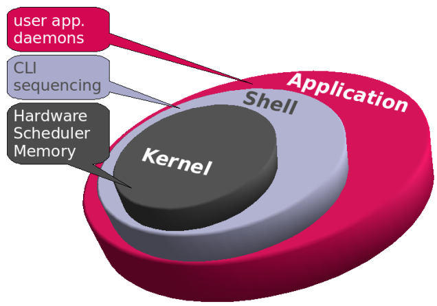

[7/3/2023]

## Course Overview
- Overview of operating systems
- Design of an operating system
- Concepts of<mark style="background: #BBFABBA6;"> APIs</mark>
- Types of <mark style="background: #FFF3A3A6;">operating systems</mark>

**Four basic units of a computer system:**
	- Hardware
	- Software
	- OS 
	- User

---
[03/04/2023]
### Generations of Operating Systems
**First generation 1950s**:
	- Single stream batch processing
	- IBM701
	- Can only operate on same type of process in batches
**Second generation 1960s**:
	- Multitasking
	- Memory management
	- Multi batch processing
 **Third Generation 1970s**:
	 - Time sharing
	 - Multiprogramming
  **Fourth Generation 1980s**:
	  - GUI
	  - Singe-user applications
  
---
   
####   Functions of operating system:
   - Security
   - management of resources
			- Memory
			- File
			- Processor
			- Device
	- Networking
	- Time Management
	- Error Detecting
	- Deadlock prevention: When all processes crash, OS should prevent that happening
	- Fault tolerant: When errors exists in an application the OS should handle the error without 
	- Interrupts Handler: It is an hardware signal from  device to a CPU. It tells the CPU that the device needs attention and that the CPU should stop performing what it is doing and respond to the device. 

### Features of an operating system:
- Scalability
- Portability
- Expendability

#### Classification of OS:
- Mainframe OS
- Server OS
- Personal Computer OS
- Embedded OS: Device which are attached to other systems.
- Distributed OS: Different devices connected together and they run the same operating system

**Task**: What you want to do
**Job**: When submitted to the processor/ also called Program. 

User View: What the OS should do for the user
				- These types are designed for ease of use
				- Can be a single user or workstation
System View: The OS view

---
### Components of OS
- Shell
- Kernel

**Shell**: It is the command interpreter. Allows users to enter command and interprets it for the kernel. It also takes the kernel's output and interprets it for the user to understand. 

**Kernel:** It is the Core Component of the OS, it contains all the managers i.e, device manager, file manager process scheduler. that perform all the functions of the OS,

Components of the kernel:
- Process Scheduler
- Memory Manager
- File system manager
- Interprocess communication manager
- I/O Manager

---
General Overview of a computer system boot sequence

1. POST on the ROM runs to check the system hardware to ensure functionality
2. Stores the result in a special memory location
3. Once the POST is succeful the softwaree loaded in ROM/BIOS will begin to activate computer's disk drives
4. When the disk drive is activated it find the bootstrap loader
5. The bootstrap loader loads the operating system into memory and allows it to begin operation. 
6. It then turns the control over to the OS

What is a bootstrap loader:
It is a small program that sets up drivers that control various hardware subsystems of the computer, during a computer startup. It then hand over the control to the OS

---
[17/04/2023]
### Hardware & Software Concepts of an OS

Application software
Utility Software
System Software
Compilers
Application Programming Interface: API

---
### Process Concepts:

**Process**: When processors work on instruction, an entity which has its own address space, ==it is  generally know as a program in execution,== it can also be called and animate object. It is a dispatchable, it is an asynchronous activity.  
	Stored in an address space consists of:
		- Text: The text region stores the code that the processor executes.
		- Data: The data region stores variables and dynamically allocated memory that the process that the process use during execution 
		- Stack: The stack region stores instructions and local variables for active procedure calls.
		
<mark style="background: #D2B3FFA6;">
Second, a process is a "program in execution." A program is an inanimate entity; only when a processor "breathes life" into a program does it become the active entity we call a process. </mark>

### Process States
- New state
- Ready/Waiting state
- Running
- Blocked
- Terminated

- A process is said to be running if it is executing on a processor.
- A process is said to be ready if it could execute on a processor if one were available.
- A process is said to be blocked if it is waiting for some event to happen before it can proceed. Event such as I/O Completion event. 
- When a thread completes its instruction it enters the terminated state.

### Process Transition:
The movement of a process from one state to another.
1. **New to Ready:** A process is being admitted to the system.  
2. **Ready to running:** A process is being **dispatched** due to the availability of processor
3. **Running to Block:** A processed is being blocked waiting for an input output event to occur
4. **Blocked to Ready:** Occur when the input/output or external event has occurred, also called wake up
5. **Running to Ready**: When the time given to run has expired, also called the quantum time. 
6. **Running to Terminate:** Also called exit. When the process has finished its execution.

### PCB:
The operating system identifies each process by assigning it a process identification number (PID). 
PCB: Process Control Block, it maintains information about each process that the operating system needs to manage the process. , those information include, 
- PID
- **process/process counter:** Is a value that determines which instruction the process will execute next.
- **Execution context:** These are the register content when the process was last running, it enables a process execution context to be restored, when the process is returned to running state.
- Schedule priority
- Process state
- address space
- pointer to the parent process (process that created the process) 
- pointers to the child process (process created by this process)
when a process transitions from one state to another, the operating 

---
## Context Switching
The operating system performs a context switch to stop executing a running process and begin executing a previously ready process. To perform a context switch, the kernel must first save the execution context of the running process to its PCB. then load the ready process's previous execution context from its PCB.
It happens when a previously blocked process receives an input/output event it becomes ready to be process.

Interrupts halts the execution of a running process to respond to a signal.
Interrupt is a hardware or software signal that tells the CPU that the device and process and attend to the particular attention

Interrupts  enable software to respond to signals from hardware. The operating system specify a set of instructions, called an interrupt handler, to be executed in response to each type of interrupt. 
	Types of interrupt:
	- Synchronous: occurs when a process attempts to perform an illegal actions, such as dividing by zero or referencing a protected memory location.
	- Asynchronous: Hardware devices issue asynchronous interrupts to communicate a status change to the processor. For example, the keyboard generates an interrupt when a user presses a key;
 
Steps of interrupt handling
1. Stops execution of running process
2. Performs context switching
3. Transfers the control to the interrupt handling to the interrupt handler
4. Processes the signal to determine what to do
5. The interrupt handler may then restore the state of the previously executing process (P1) or call the operating system processor scheduler to determine the "next" process to run. In this case, the handler calls the process scheduler, which decides that process P2, the highest-priority waiting process, should obtain the processor 
6. The context for process P2 is then loaded from its PCB in main memory, and process P1's execution context is saved to its PCB in main memory.

Within the time of interrupt handling the processor is idle which reduces the throughput of the cpu.
On the other hand, interrupt allows blocked processes to become ready

Operations that can occur on a process:
• create a process • destroy a process • suspend a process • resume a process • change a process's priority • block a process • wake up a process • dispatch a process

### Interproccess Communication Manager

Concurrent processes: Processes that run together, non communication of processes can lead to clashes when requesting a location. 
Processes communicate message passing and sending signals to each other. 

<mark style="background: #FFB86CA6;">Race conditinion</mark>

### Threads
Thread is similar to a process but lightweight, when a process is divided into smaller tasks which are called threads. The output of the threads are joined together to form the actual output of the process. They use processor to execute and other resources processes use, such as address space and open file. They have their individual thread IDs, threads also have their own states, ready, blocked and terminated, dead(once its done executing), asleep. Operations that can be performed on a process can also be performed on a thread.  